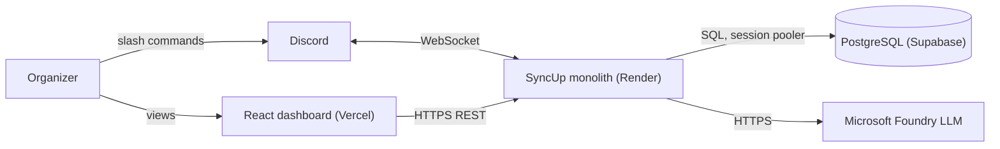
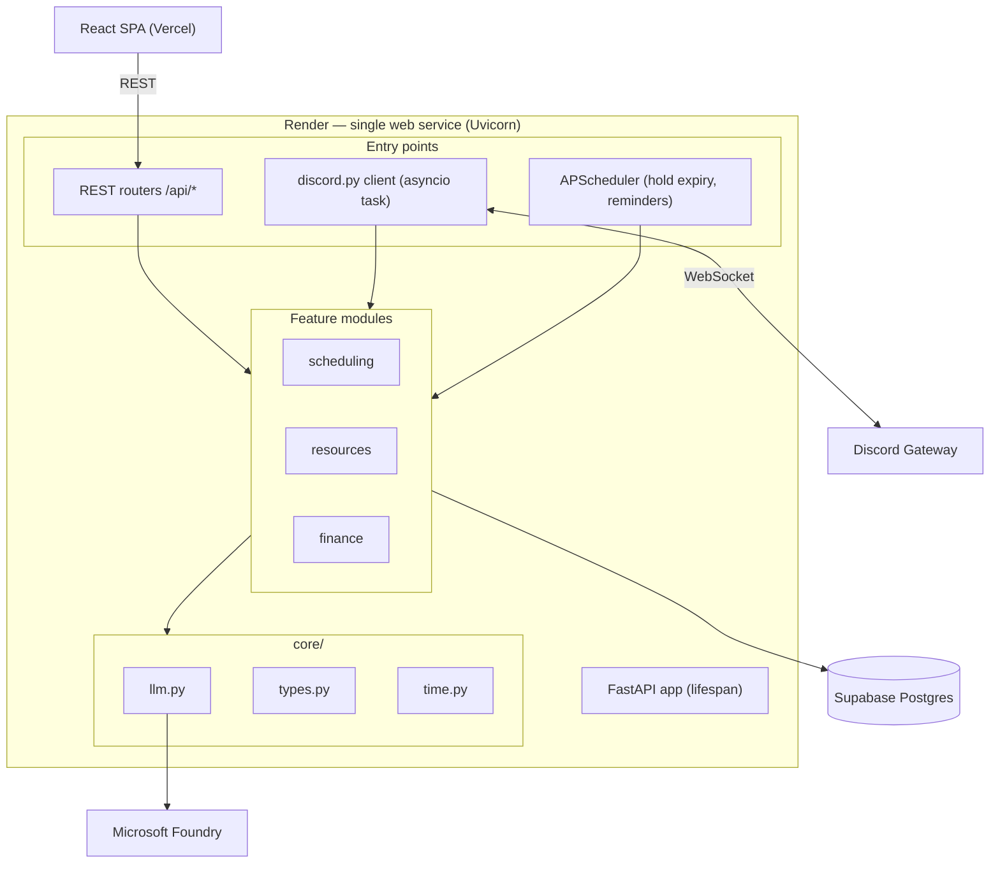
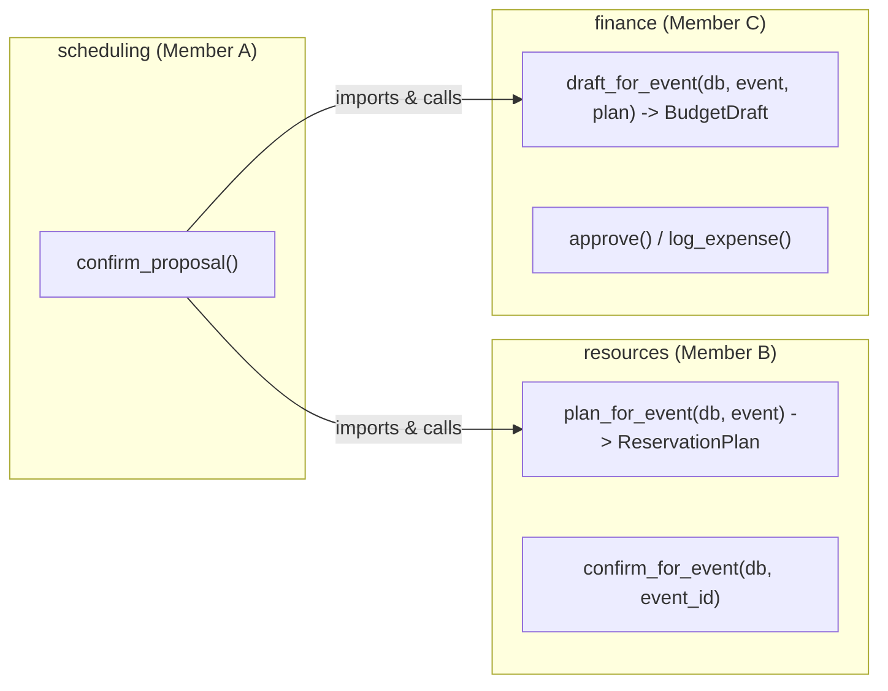
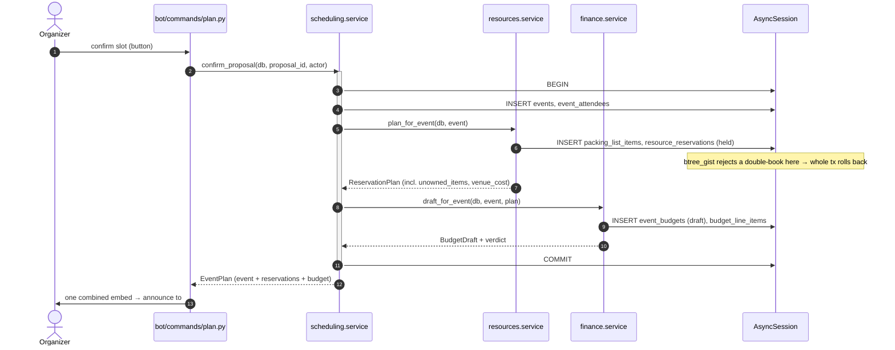
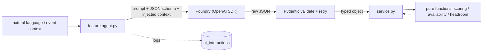
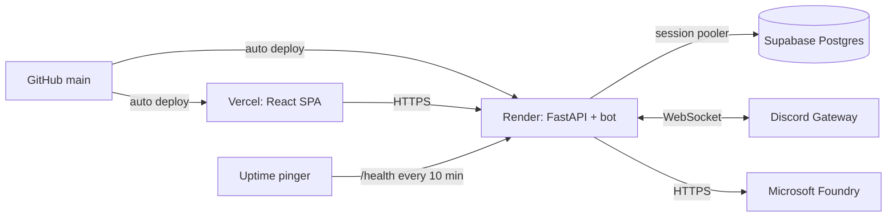

# Architecture.md

System design for **SyncUp** — an AI operations manager for student organizations.
For coding rules see `CLAUDE.md`; for the local dev loop see `harness.md`.

---

## 1. One-paragraph overview

SyncUp is a **monolithic** async Python application. A single FastAPI process serves a REST API *and* runs a Discord bot as a background task, backed by one PostgreSQL database on Supabase and one LLM endpoint on Microsoft Foundry. A separate React SPA on Vercel provides a read-mostly dashboard. The three product capabilities — scheduling, resource planning, financial planning — are Python packages inside the one process, not separate services.

## 2. Design principles

| Principle | Consequence |
|---|---|
| **One conflict primitive, three domains** | Time, resource, and budget conflicts are all interval/quantity overlaps detected before commit. Shared mental model across modules. |
| **LLM proposes, Python decides** | Deterministic Python owns every number. The model only parses language and explains results. Reproducible, explainable, cheap. |
| **Atomic by default** | The event-confirm flow spans three modules in one DB transaction. Chosen deliberately over a distributed design. |
| **Boring over clever** | 24-hour build: no message queue, no microservices, no eventual consistency. Every dependency is a 3am failure mode. |
| **Modules, not services** | Clear ownership boundaries and interfaces give parallel work *without* network hops. |

## 3. Context diagram

## 4. Container / process view

One deployable backend. The bot, the API, and the scheduler share the process, the connection pool, the models, and the feature services.

### Why a monolith (the trade-off, stated honestly)

| Benefit | Cost we accept |
|---|---|
| **Atomic multi-module writes** in one transaction | Modules are coupled via direct imports |
| **One deploy, one cold start** (critical on Render free tier) | The whole app scales as a unit |
| **Shared connection pool** stays within Supabase free limits | A crash takes down bot + API together |
| **No network serialization** between features — pass typed objects | Requires discipline (import direction, no premature commits) |

For a 3-person, 24-hour, single-tenant demo the benefits dominate. At real scale you would extract the bot and the jobs into separate processes; we explicitly don't.

## 5. Module boundaries and interfaces

Each module exposes a small, typed Python interface. These signatures are the only cross-team contracts.

**Import rule:** `scheduling → {resources, finance}` only. The reverse is forbidden (circular import). Shared dataclasses (`EventView`, `ReservationPlan`, `UnownedItem`, `BudgetDraft`) live in `app/core/types.py` so the leaf modules never need to import scheduling.

## 6. The confirm transaction — key sequence

The single most important flow in the system. One user action, one transaction, three modules.

## 7. Data architecture

- **One database, one `public` schema, one SQLAlchemy `MetaData`, one Alembic chain.** Foreign keys cross module boundaries freely — the schema-level payoff of the monolith.
- **UUID PKs** (`gen_random_uuid()`) so three developers seed independently without sequence collisions.
- **`TIMESTAMPTZ` everywhere, UTC.** **`NUMERIC(12,2)`** for money. **`JSONB`** for volatile LLM output (`parsed_constraints`, `conflicts`). **`TEXT` + `CHECK`** instead of PG `ENUM`.
- **`btree_gist` exclusion constraint** on `resource_reservations` makes double-booking impossible at the data layer. **GiST indexes** on `tstzrange(...)` for the hot overlap queries.
- **Soft status columns, no hard deletes** — cancelled events and released holds stay visible for audit/variance views.
- **`ai_interactions`** logs every model call (prompt, tool calls, tokens, latency).

Entity relationships and full DDL live in `docs/04-Database-Schema.html` and `schema.sql`. Table ownership:

| Module | Tables |
|---|---|
| Shared | `organizations`, `members`, `venues`, `ai_interactions` |
| Scheduling | `busy_blocks`, `scheduling_requests`, `slot_proposals`, `events`, `event_attendees` |
| Resources | `resources`, `resource_reservations`, `packing_list_items` |
| Finance | `budgets`, `event_budgets`, `budget_line_items`, `expenses` |

## 8. The AI layer

The model has exactly two jobs per feature: **parse** (language → structured constraints) and **explain** (ranked result → prose). It never scores, never checks availability, never totals money. Open-vocabulary proposals are resolved against closed vocabularies (real inventory IDs, real categories) server-side.

## 9. Interface & deployment topology

| Component | Host | Free-tier constraint that shapes design |
|---|---|---|
| Backend + bot | Render | Spins down after **15 min** idle; **30–60s** cold start → uptime pinger + pre-demo warmup. Ephemeral FS → nothing durable on local disk |
| Frontend | Vercel | `VITE_*` vars baked at **build** time → redeploy to change |
| Database | Supabase | IPv6-only direct connection → **use the Supavisor pooler**. 500 MB / 200 pooler connections (ample) |
| LLM | Foundry | Free quota → low temperature, dev-time caching, log usage |

## 10. Cross-cutting concerns

- **Config**: `pydantic-settings` reads env; rewrites the DB URL to `+asyncpg` and strips `sslmode`. Secrets only in Render/Vercel dashboards, never git.
- **Auth**: single-tenant demo — a shared API key for dashboard calls; Discord user IDs map to `members` for lightweight identity. No full OAuth.
- **Time**: all overlap math in `core/time.py`; UTC in, localized only at render.
- **Errors**: one shape (`{"detail","code"}`); catch `IntegrityError` from the exclusion constraint and return a friendly conflict.
- **Observability**: `/health` for Render; `ai_interactions` for the AI; structured logs to stdout (Render captures them).
- **Background work**: APScheduler in-process — `expire_holds` (5 min), reminders. No external worker/broker.

## 11. Explicitly out of scope (and why)

| Not doing | Why |
|---|---|
| Microservices / message queue | Distributed complexity with zero demo value in 24h |
| Multi-tenant auth / RBAC | Single demo org; a shared key suffices |
| Live calendar (ICS/Graph) sync as a hard dependency | Nice-to-have; seed `busy_blocks` if it stalls — demo looks identical |
| Real payment/reimbursement rails | We track money, we don't move it |
| Horizontal scaling | Single Render instance is the target |

## 12. If we had more time

Extract the Discord bot and APScheduler into their own Render worker; add Supabase Auth for real multi-org tenancy; move `ai_interactions` into a proper eval harness with regression prompts; add live calendar ingestion; put a Redis cache in front of the LLM. None of these are on the 24-hour path.
